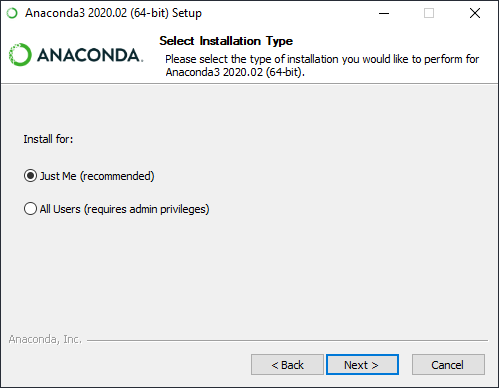

## Installeren van Python (Anaconda)
Een beknopte handleiding voor het installeren van Python met Anaconda.

Ga naar [anaconda](https://repo.anaconda.com/archive/).

Download [deze](https://repo.anaconda.com/archive/Anaconda2-2019.10-Windows-x86_64.exe)

Dubbelklik op gedownload bestand

Druk op Next:

Druk op I agree

Kies voor de standaardoptie:

Vink de eerste optie 'Add Anaconda to my PATH' AAN en druk op 'Install'. Deze stap kan wel even duren (soms wel een half uur). Daarna klik je nog een aantal keer op volgende en is Anaconda geïnstalleerd.

